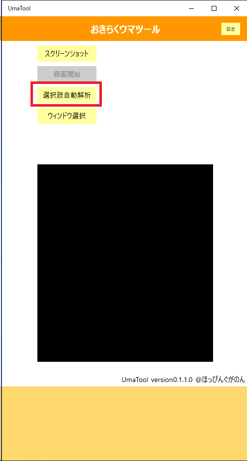
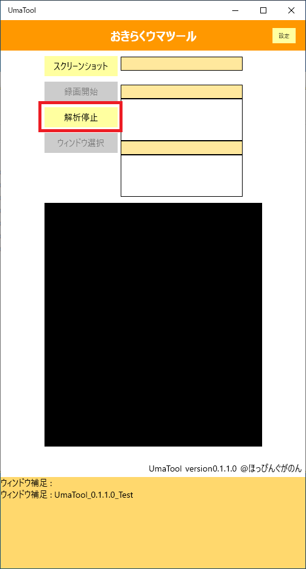

# 選択肢自動解析
備忘録としての処理のフローを記す。

### ボタンクリックイベント発生
#### 選択肢自動解析状態でない場合

解析処理を非同期で行う。
処理終了後、一定のディレイをかけてから再度処理をループする。

#### 選択肢自動解析中

選択肢自動解析中は、本ボタンは`解析停止`というテキストに変わっている。
押すとキャンセルトークンによって自動解析が終了し、全ての状態が元に戻る。

### 画像データの取得
スクリーンプレビューのフレームをバイト列に変換する。バイト列はBGRA(深さ8bits)となる。

スクリーンプレビューのフレームから画像を切り抜く。
切り抜くには極めて原始的なバイト列2重ループを行う(Cでビットマップを読んでた頃を思い出しながら)。

切り抜いた画像はByte[]型なので、これをSoftwareBitmapオブジェクトに変換する。

### 画像データの読み取り
OCRで上記の画像を読み取ってstring型の文字列に変換する。
その際、スペーズを除去したうえで文字列の長さが短い場合は解析をキャンセルする。

### 選択肢の解析
全イベントの選択肢と、画面上で読み取った選択肢の類似度を比較して、もっとも類似度の高いものを結果として表示する。

比較には文字列の類似度を示すレーベンシュテイン距離を用いる。
元の文字列の長さと、レーベンシュテイン距離の比が一定以下なら解析をキャンセルする。