# つかいかた
このドキュメントはv0.1.1.0を対象にしています。

## インストール方法

`Install.ps1`を右クリックしてください。

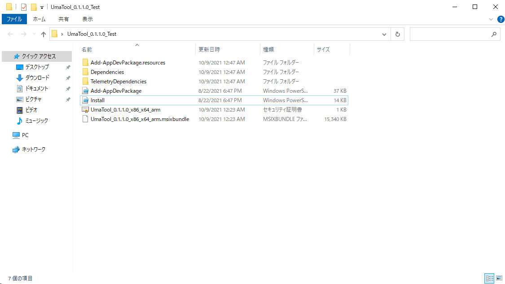

`Powershellで実行`または`Run With Powershell`があるので選択してください。

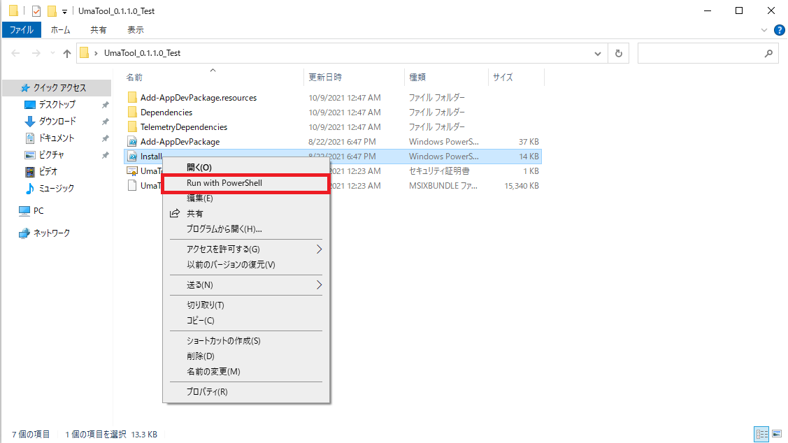

わらわらとウィンドウが表示されます。もし下記のような設定画面が開いたら`開発者用モード`をオンにしてください。

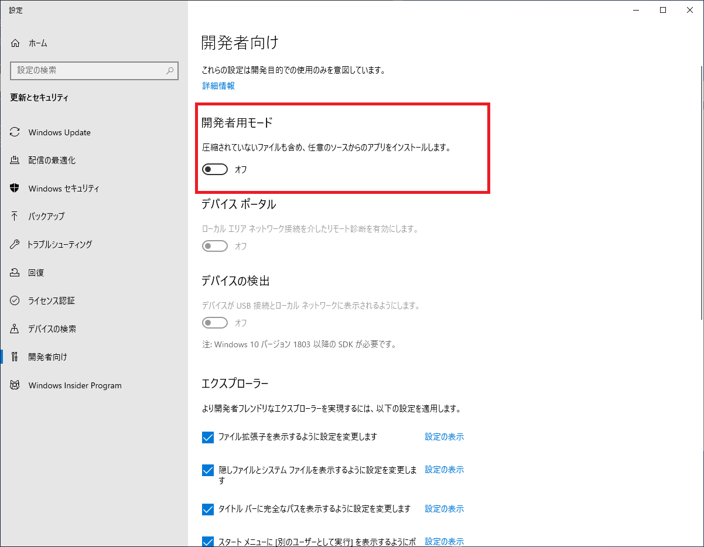

再確認されますが、`はい`を押してください。

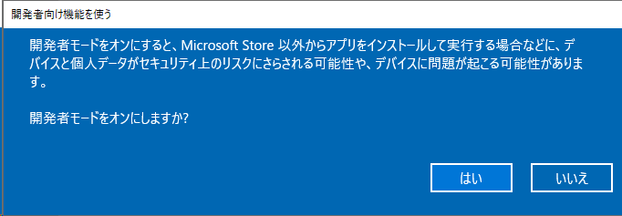

※開発者モードに変更する際は、危険性を理解したうえで自己責任で行ってください。

裏側のウィンドウのうち、以下のような表示のウィンドウを開き、キーボードで`Y`を入力してください。

※このステップで、Windows10にこのアプリの証明書がインストールされます。更新が止まってたりする場合は証明書の期限が切れて表示が異なるかもしれません。

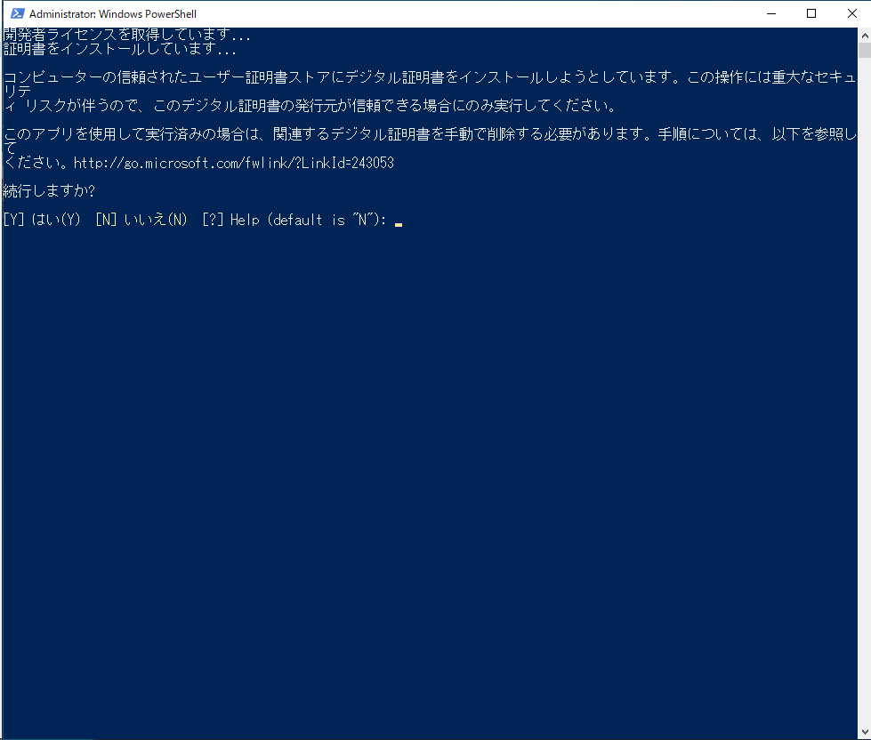

下記のように表示されたら、インストールは完了です。`Enter`キーを押してこの画面を終了してください。

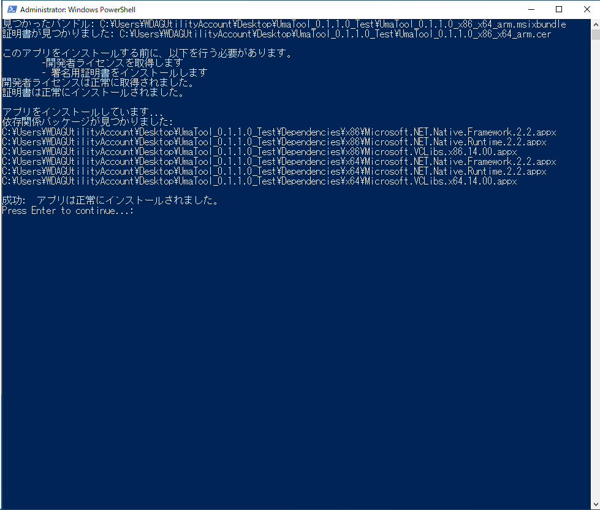

メニューで`UmaTool`がインストールされていることが確認できます。

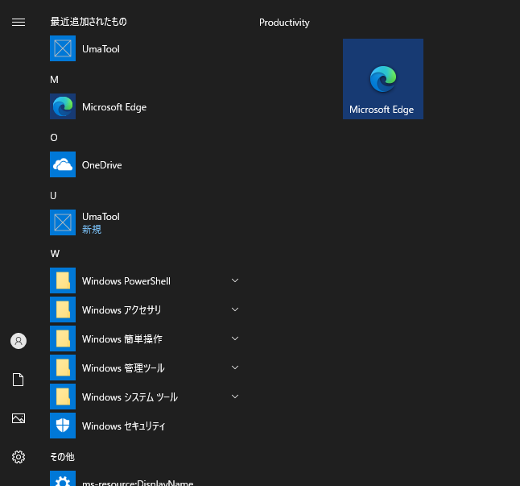

## つかいかた
起動すると以下のような大きさになっていると思います。
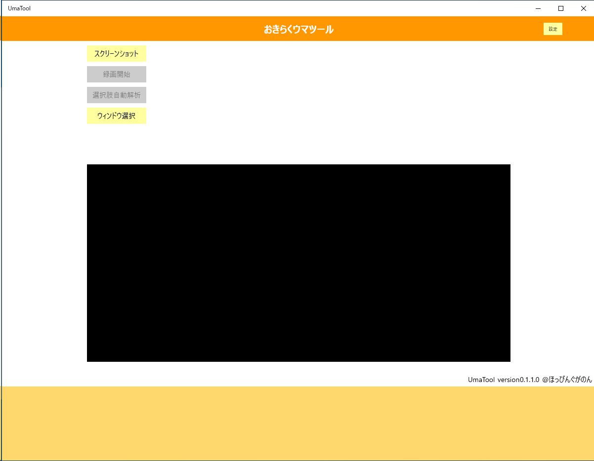

また、まだ`EventData.json`を読み込んでないので、ファイルが存在しないという通知が出ると思います。

使用前に、ウィンドウサイズを調節してください。(現バージョンでは、ウィンドウ選択前にサイズ変更しておかないと表示が崩れます)

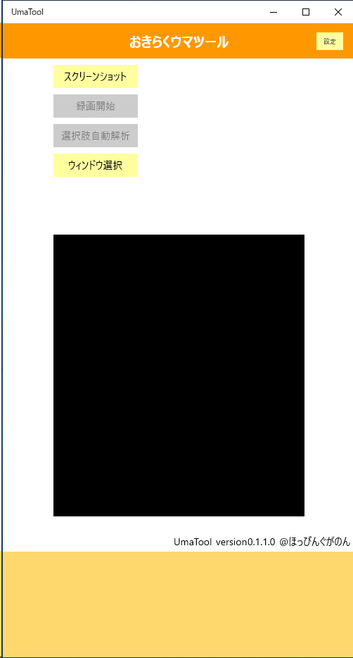


### ウィンドウを選択する
`ウィンドウ選択`ボタンを押すと、今開いているウィンドウを一覧してくれるので、ウィンドウを選択します。

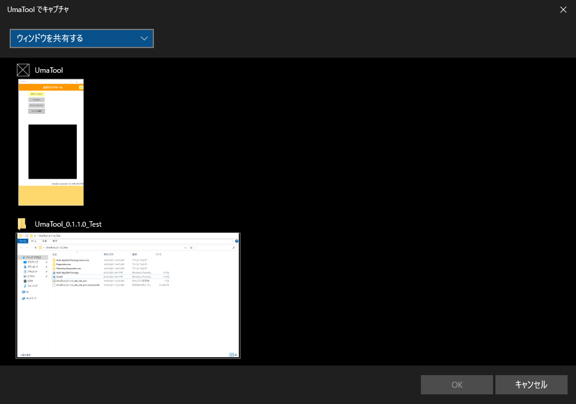

### スクリーンショットの撮り方
ウィンドウ選択状態で`スクリーンショット`ボタンを押すと、`(そのウィンドウ名).png`でユーザーのピクチャフォルダに保存されます。

この機能は、対象ウィンドウがゲームでなくても使用することができます。

※保存先を可変にしたいところではありますが、未実装です。

### 選択肢自動解析
この機能を利用するには、先述の[【イベントデータの準備】](#イベントデータの準備)を完了してください。

先述の[【ウィンドウを選択する】](#ウィンドウを選択する)にて育成ゲームのウィンドウを選択した状態で、`選択肢自動解析`ボタンを押してください。

## イベントデータの準備
後述する`選択肢自動解析`の機能を利用する際には必須の手順です。

### イベントデータの作成
イベントデータの作成を自身で行ってください。
(本アプリ内にはそんなシビアなデータを含めることはできませんでした...)

``` json
[
    {
        "title":  "ワイ、仕事辞めるってよ",
        "category":  "通常",
        "name":  "ワイ",
        "choices":  [
                        {
                            "text":  "はやく勉強しなくちゃな",
                            "effect":  "体力+10\nやる気効果アップ"
                        },
                        {
                            "text":  "負けてられないぞ",
                            "effect":  "賢さ+10\n『C言語』のスキルヒントLv+255"
                        }
                    ]
    }
]
```

各キーに対するバリューの意味について

|キー|意味|必須|
|:-|:-|:-:|
|title|イベント名|○|
|category|通常/勝負服|-|
|name|イベントが発生するキャラ名|-|
|text|選択肢で出る文字列|○|
|effect|選択肢の効果|○|

必須ではない項目については、今後機能追加で表示に関わるかもしれないものですが、今のところなくてもいいです。

これを作るためのツールも作ろうと思いましたが、先の先になりそうです。

### イベントデータのロード
`設定`ボタンを押してください。

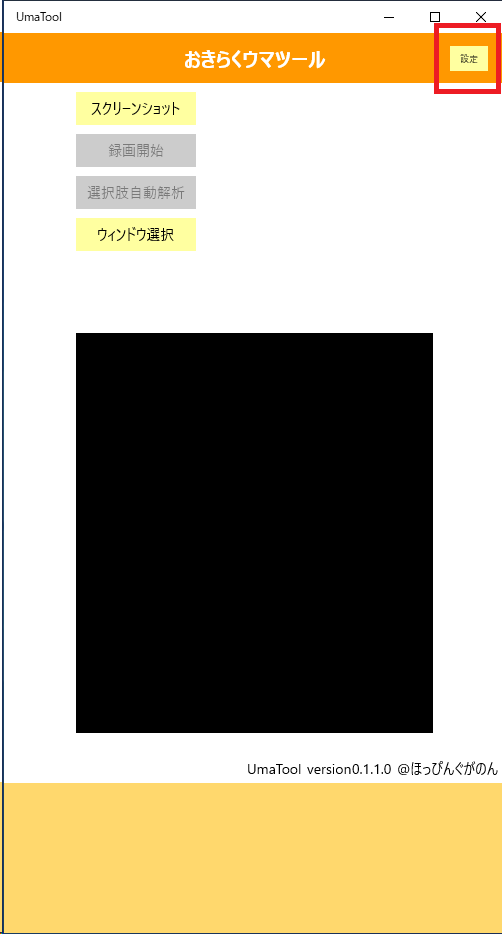

作成したイベントデータを選択してください。

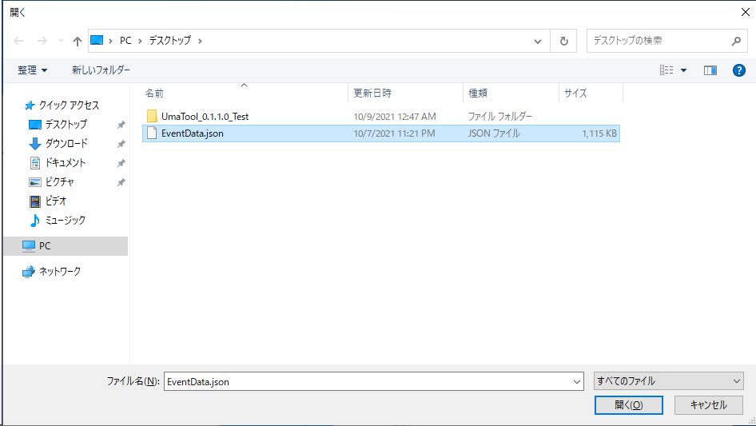

読み込みに成功すると、`選択肢自動解析`ボタンがアクティブになります。

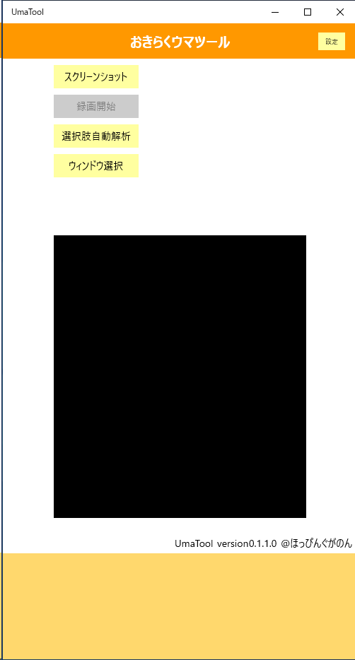

※本当はこの設定ボタンから別のウィンドウに飛んで、写真の保存場所や細かいOCRの微調整もできる用にしたかったのですが、現バージョンでは未実装です。