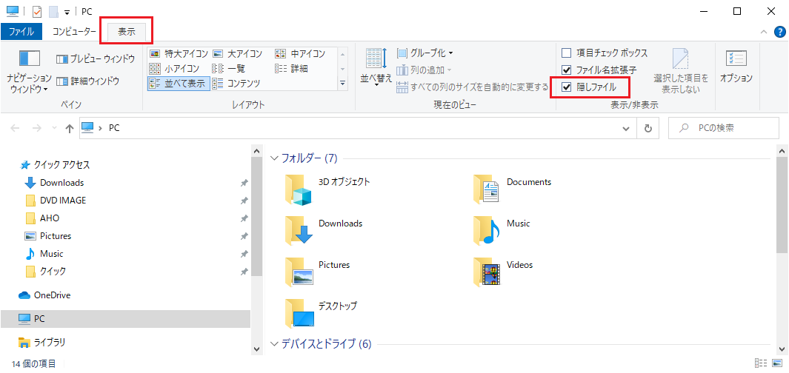

# つかいかた
## 使用の前の準備
まず、イベントデータの作成は自身で行ってください。
本アプリ内にはそんなシビアなデータを含めることはできませんでした...

``` json
[
    {
        "title":  "ワイ、仕事辞めるってよ",
        "category":  "通常",
        "name":  "ワイ",
        "choices":  [
                        {
                            "text":  "はやく勉強しなくちゃな",
                            "effect":  "体力+10\nやる気効果アップ"
                        },
                        {
                            "text":  "負けてられないぞ",
                            "effect":  "賢さ+10\n『C言語』のスキルヒントLv+255"
                        }
                    ]
    }
]
```

|キー|説明|必須|
|:-|:-|:-:|
|title|イベント名|○|
|category|通常/勝負服|-|
|name|イベントが発生するキャラ名|-|
|text|選択肢で出る文字列|○|
|effect|選択肢の効果|○|


これを作るためのツールも作ろうと思いましたが、先の先になりそうです。

上記のJSONデータを`Assets/EventData.json`の中に入れておいてください。

配置の仕方
### 隠しフォルダを表示できるようにする




### UWPアプリの保存場所にアクセスする
幻のフォルダ`C:\Program Files\WindowsApps`


## スクリーンショットをとるには？
まず、


## 